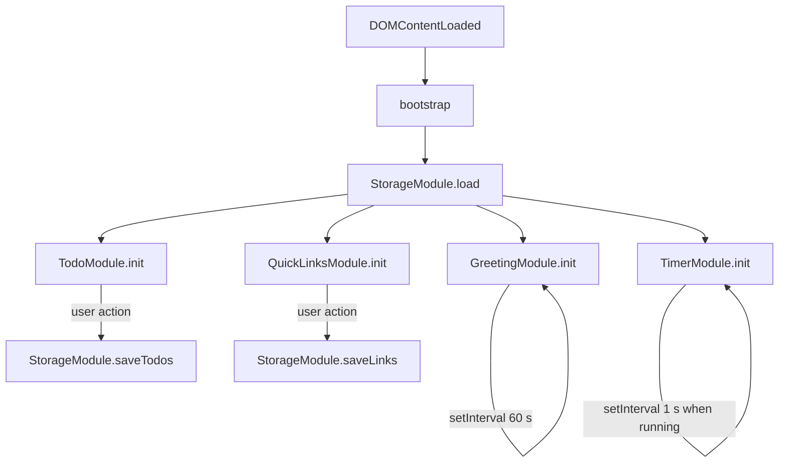
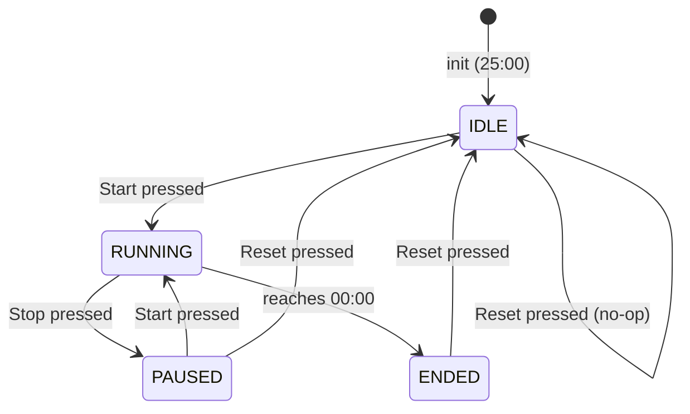

# Design Document — To-Do Life Dashboard

## Overview

The To-Do Life Dashboard is a zero-dependency, single-page web application that runs entirely in the browser. It delivers four independent widgets on one screen:

- **Greeting_Widget** — live clock, date, and time-of-day greeting
- **Focus_Timer** — 25-minute Pomodoro-style countdown
- **Todo_List** — persistent task list with add / edit / complete / delete
- **Quick_Links** — customisable shortcut panel that opens URLs in new tabs

All persistence is handled through the browser's `localStorage` API. No server, no build step, no external libraries.

### Key Design Goals

1. **Zero-dependency** — HTML + CSS + Vanilla JS only (Requirement 8.1)
2. **Single entry-point** — `index.html` → `styles.css` + `app.js` (Requirement 8.4)
3. **Offline-first** — works as a local file or browser extension (Requirement 8.2–8.3)
4. **Fast** — TTI ≤ 2 s, interaction feedback ≤ 100 ms (Requirement 9.1–9.2)

---

## Architecture

### File Structure

```
/
├── index.html       ← single entry-point; declares structure and imports
├── styles.css       ← all visual styling, responsive layout
└── app.js           ← all application logic (modules via IIFE namespaces)
```

The entire app ships as three files. No transpilation, bundling, or server is required.

### Module Organisation in `app.js`

`app.js` is structured as a set of IIFE-namespaced modules that communicate through shared state passed as arguments. A thin bootstrap function wires everything together on `DOMContentLoaded`.

```
app.js
│
├── StorageModule       — low-level localStorage read/write helpers
├── GreetingModule      — clock ticking, greeting logic, DOM updates
├── TimerModule         — countdown state machine, DOM updates
├── TodoModule          — task CRUD, edit-mode state, DOM rendering
├── QuickLinksModule    — link CRUD, URL validation, DOM rendering
│
└── bootstrap()         — binds all modules to the DOM on load
```

### Interaction Flow



No inter-module events bus is needed — each module owns its own DOM section and writes to Storage independently.

---

## Components and Interfaces

### Greeting_Widget

**Responsibility**: Display the current time, current date, and a contextual greeting string. Refresh every minute.

**DOM Structure**

```html
<section id="greeting-widget" aria-label="Greeting">
  <p id="greeting-text"></p>      <!-- "Good Morning" | "" -->
  <h1 id="current-time"></h1>     <!-- "14:07" -->
  <p id="current-date"></p>       <!-- "Monday, 16 June 2025" -->
</section>
```

**Public API (`GreetingModule`)**

| Function | Signature | Description |
|---|---|---|
| `init` | `() → void` | Renders once, then schedules a tick every 60 s |
| `tick` | `() → void` | Reads `new Date()`, updates all three DOM elements |
| `getGreeting` | `(hour: number) → string` | Pure function; returns greeting string for given 0–23 hour |
| `formatTime` | `(date: Date) → string` | Returns `"HH:MM"` in 24-hour format |
| `formatDate` | `(date: Date) → string` | Returns `"Weekday, DD Month YYYY"` |

`getGreeting` is the only pure, testable function in this module.

---

### Focus_Timer

**Responsibility**: Manage a 25-minute countdown. States: `IDLE | RUNNING | PAUSED | ENDED`.

**DOM Structure**

```html
<section id="focus-timer" aria-label="Focus Timer">
  <div id="timer-display">25:00</div>     <!-- MM:SS -->
  <div id="timer-ended-indicator" hidden>Session ended</div>
  <button id="btn-start">Start</button>
  <button id="btn-stop">Stop</button>
  <button id="btn-reset">Reset</button>
</section>
```

**State Machine**



**Public API (`TimerModule`)**

| Function | Signature | Description |
|---|---|---|
| `init` | `() → void` | Sets state to IDLE, renders 25:00 |
| `start` | `() → void` | Transitions IDLE/PAUSED → RUNNING; starts `setInterval` |
| `stop` | `() → void` | Transitions RUNNING → PAUSED; clears interval |
| `reset` | `() → void` | Any state → IDLE; restores 25:00, hides ended indicator |
| `tick` | `() → void` | Decrements `remainingSeconds`, handles ENDED transition |
| `formatTime` | `(totalSeconds: number) → string` | Pure; returns `"MM:SS"` |
| `getState` | `() → string` | Returns current state label |

`formatTime` and the countdown decrement logic are the key testable pure functions.

---

### Todo_List

**Responsibility**: Manage a mutable, ordered list of Task objects. Supports add, edit, complete-toggle, and delete. Persists to Storage after every mutation.

**DOM Structure**

```html
<section id="todo-list" aria-label="To-Do List">
  <form id="todo-add-form">
    <input id="todo-input" type="text" placeholder="Add a task…" />
    <button type="submit">Add</button>
  </form>
  <ul id="todo-items">
    <!-- rendered by TodoModule.render() -->
    <li data-id="<uuid>">
      <input type="checkbox" aria-label="Complete task" />
      <span class="task-label">Task description</span>
      <button class="btn-edit">Edit</button>
      <button class="btn-delete">Delete</button>
    </li>
    <!-- edit mode: span replaced by input + Save button; Escape cancels -->
  </ul>
</section>
```

**Public API (`TodoModule`)**

| Function | Signature | Description |
|---|---|---|
| `init` | `() → void` | Loads from Storage, renders list, binds form submit |
| `addTask` | `(description: string) → boolean` | Validates, appends Task, persists; returns false if invalid |
| `editTask` | `(id: string, newDescription: string) → boolean` | Validates, updates Task, persists; returns false if invalid |
| `toggleTask` | `(id: string) → void` | Flips `completed`, persists |
| `deleteTask` | `(id: string) → void` | Removes Task, persists |
| `enterEditMode` | `(id: string) → void` | Cancels any active edit first (Req 4.7) |
| `cancelEditMode` | `() → void` | Restores display text without saving |
| `render` | `() → void` | Full re-render of `#todo-items` from in-memory array |
| `isValidDescription` | `(value: string) → boolean` | Pure; trims + checks non-empty, ≤ 500 chars |

---

### Quick_Links

**Responsibility**: Display, add, and delete user-defined Link objects. Validates URL format before adding. Persists to Storage after every mutation.

**DOM Structure**

```html
<section id="quick-links" aria-label="Quick Links">
  <div id="links-panel">
    <!-- rendered by QuickLinksModule.render() -->
    <button class="link-btn" data-url="https://…">Label</button>
    <button class="link-btn link-btn--invalid" data-url="bad-url">
      Label ⚠
    </button>
    <button class="btn-delete-link" data-id="<uuid>">×</button>
  </div>
  <form id="link-add-form">
    <input id="link-label-input" type="text" placeholder="Label" />
    <input id="link-url-input" type="url" placeholder="https://…" />
    <button type="submit">Add Link</button>
    <p id="link-error" role="alert" aria-live="polite"></p>
  </form>
</section>
```

**Public API (`QuickLinksModule`)**

| Function | Signature | Description |
|---|---|---|
| `init` | `() → void` | Loads from Storage, renders panel, binds form submit |
| `addLink` | `(label: string, url: string) → boolean` | Validates both fields, appends Link, persists; returns false + sets error msg on failure |
| `deleteLink` | `(id: string) → void` | Removes Link, persists |
| `navigateLink` | `(url: string) → void` | Calls `window.open(url, '_blank')` if URL valid |
| `render` | `() → void` | Full re-render of `#links-panel` from in-memory array |
| `isValidLinkLabel` | `(label: string) → boolean` | Pure; 1–100 chars |
| `isValidLinkUrl` | `(url: string) → boolean` | Pure; 1–2048 chars, starts with `http://` or `https://` |
| `validateAddLink` | `(label: string, url: string) → ValidationResult` | Pure; returns `{ valid, error }` |

---

### Storage Module

**Responsibility**: Thin, synchronous wrapper around `localStorage` with typed keys, JSON serialisation, and error isolation.

**Public API (`StorageModule`)**

| Function | Signature | Description |
|---|---|---|
| `loadTodos` | `() → Task[]` | Reads `"tld_todos"`; returns `[]` on failure |
| `saveTodos` | `(tasks: Task[]) → boolean` | Serialises + writes; returns false on quota/error |
| `loadLinks` | `() → Link[]` | Reads `"tld_links"`; returns `[]` on failure |
| `saveLinks` | `(links: Link[]) → boolean` | Serialises + writes; returns false on quota/error |

All Storage functions catch errors internally — callers check the boolean return value but never need to catch.

---

## Data Models

### Storage Keys

| Key | Value type | Description |
|---|---|---|
| `tld_todos` | `Task[]` (JSON) | Ordered array of all tasks |
| `tld_links` | `Link[]` (JSON) | Ordered array of all quick links |

### Task

```json
{
  "id": "uuid-v4-string",
  "description": "Buy milk",
  "completed": false
}
```

| Field | Type | Constraints |
|---|---|---|
| `id` | `string` | UUID v4; generated at creation; immutable |
| `description` | `string` | 1–500 characters (trimmed); non-empty |
| `completed` | `boolean` | `false` on creation; toggled by user |

### Link

```json
{
  "id": "uuid-v4-string",
  "label": "GitHub",
  "url": "https://github.com"
}
```

| Field | Type | Constraints |
|---|---|---|
| `id` | `string` | UUID v4; generated at creation; immutable |
| `label` | `string` | 1–100 characters |
| `url` | `string` | 1–2048 characters; starts with `http://` or `https://` |

### In-memory State

Both `TodoModule` and `QuickLinksModule` maintain a private in-memory array (`tasks[]`, `links[]`) that is the single source of truth during a session. Every mutation:
1. Updates the in-memory array
2. Calls the corresponding `StorageModule.save*` function
3. Calls `render()` to sync the DOM

---

## UI Layout and Visual Hierarchy

### Responsive Grid Layout

```
┌─────────────────────────────────────────────────────┐
│                  Greeting_Widget                    │
│         "Good Afternoon  |  14:07  |  Monday …"     │
├────────────────────┬────────────────────────────────┤
│   Focus_Timer      │        Todo_List               │
│   25:00            │  [ + Add task input ]          │
│  [Start][Stop][Rst]│  ☐ Task 1  [Edit] [×]          │
│                    │  ✓ Task 2  [Edit] [×]          │
│                    │  …                             │
├────────────────────┴────────────────────────────────┤
│                   Quick_Links                       │
│  [GitHub] [Notion] [Gmail]  [+ Add link]            │
└─────────────────────────────────────────────────────┘
```

The CSS grid uses two named rows and a two-column layout on desktop (≥ 1024 px), collapsing to a single-column stack on smaller viewports.

```css
.dashboard-grid {
  display: grid;
  grid-template-areas:
    "greeting  greeting"
    "timer     todos"
    "links     links";
  grid-template-columns: minmax(240px, 1fr) 2fr;
  gap: 1.5rem;
}
```

### Visual Hierarchy Rules (Requirement 9.3–9.4)

- Section headings: `font-size: 1.25rem` minimum (≥ 1.25× body size of `1rem`)
- Heading font weight: `600` or `700` to distinguish from body text
- Body font size: `14px` minimum (`font-size: 0.875rem` on `html` base)
- Colour contrast: all text/background combinations validated against WCAG 2.1 AA (4.5:1 normal, 3:1 large)
- Completed tasks: `text-decoration: strikethrough`, reduced opacity

### Timer Display

The `#timer-display` element uses a large monospace font (`font-size: 3rem`, `font-variant-numeric: tabular-nums`) so the width does not shift as digits change.

---

## Correctness Properties

*A property is a characteristic or behavior that should hold true across all valid executions of a system — essentially, a formal statement about what the system should do. Properties serve as the bridge between human-readable specifications and machine-verifiable correctness guarantees.*

The pure-function layer of this application (greeting classification, time formatting, timer formatting, task/link validation, CRUD mutation + storage round-trips) is well-suited to property-based testing. The UI event-binding and external side-effect layers (window.open, setInterval) are better covered by example-based and integration tests.

---

### Property 1: Greeting classification covers all 24 hours

*For any* integer hour in [0..23], `getGreeting(hour)` SHALL return exactly one of `"Good Morning"`, `"Good Afternoon"`, `"Good Evening"`, `"Good Night"`, or `""` (empty string), and the specific return value SHALL be determined by the hour ranges defined in requirements 1.3–1.7.

**Validates: Requirements 1.3, 1.4, 1.5, 1.6, 1.7, 1.8**

---

### Property 2: Time format is always valid HH:MM

*For any* `Date` object, `GreetingModule.formatTime(date)` SHALL return a string that matches the pattern `HH:MM` where `HH` is in [00..23] and `MM` is in [00..59].

**Validates: Requirements 1.1**

---

### Property 3: Date format is always valid "Weekday, DD Month YYYY"

*For any* `Date` object, `GreetingModule.formatDate(date)` SHALL return a string containing a valid English weekday name, a numeric day (1–31), a valid English month name, and a four-digit year in the format `"Weekday, DD Month YYYY"`.

**Validates: Requirements 1.2**

---

### Property 4: Timer formatTime is always valid MM:SS for any valid remaining seconds

*For any* integer `n` in [0..1500], `TimerModule.formatTime(n)` SHALL return a string matching the pattern `MM:SS` where `MM` is in [00..25] and `SS` is in [00..59], and the value correctly represents `n` seconds.

**Validates: Requirements 2.7**

---

### Property 5: Timer reset always restores to initial state

*For any* timer state (IDLE, RUNNING, PAUSED, or ENDED) with any remaining seconds value, calling `TimerModule.reset()` SHALL set remaining seconds to 1500 (25:00) and set state to IDLE.

**Validates: Requirements 2.5**

---

### Property 6: Valid task description is accepted and persists (add round-trip)

*For any* non-empty, non-whitespace-only string of 1–500 characters, calling `TodoModule.addTask(description)` SHALL append exactly one Task to the task list, and `StorageModule.loadTodos()` immediately after SHALL include a Task with that exact trimmed description.

**Validates: Requirements 3.2, 3.4**

---

### Property 7: Empty or whitespace-only description is always rejected

*For any* string composed entirely of whitespace characters (including the empty string), `TodoModule.isValidDescription(value)` SHALL return `false`, and calling `TodoModule.addTask(value)` SHALL leave the task list unchanged.

**Validates: Requirements 3.3**

---

### Property 8: Edit round-trip preserves new description

*For any* existing task and any valid new description (non-empty, non-whitespace, ≤ 500 characters), calling `TodoModule.editTask(id, newDescription)` SHALL update the task's description to the trimmed new value, and `StorageModule.loadTodos()` immediately after SHALL reflect the updated description.

**Validates: Requirements 4.3, 4.5**

---

### Property 9: Invalid edit leaves description unchanged

*For any* existing task and any string that is empty or whitespace-only, calling `TodoModule.editTask(id, invalidValue)` SHALL return `false` and leave the task's description equal to its original value.

**Validates: Requirements 4.4**

---

### Property 10: Only one task can be in edit mode at a time

*For any* list of two or more tasks, calling `TodoModule.enterEditMode(idA)` followed by `TodoModule.enterEditMode(idB)` (where idA ≠ idB) SHALL result in only task B being in edit mode; task A's description SHALL remain at its original value.

**Validates: Requirements 4.7**

---

### Property 11: Completion toggle always flips the completed state

*For any* task in the list, calling `TodoModule.toggleTask(id)` SHALL flip the `completed` field (false → true or true → false), and `StorageModule.loadTodos()` immediately after SHALL reflect the new `completed` value.

**Validates: Requirements 5.2, 5.3, 5.4**

---

### Property 12: Deleting a task removes it from list and storage

*For any* non-empty task list and any task id in that list, calling `TodoModule.deleteTask(id)` SHALL result in that task no longer appearing in the in-memory list, and `StorageModule.loadTodos()` immediately after SHALL not contain a task with that id.

**Validates: Requirements 5.6**

---

### Property 13: Rendered link buttons display correct labels

*For any* array of Link objects, `QuickLinksModule.render()` SHALL produce exactly one button per link, and each button's visible text SHALL equal the corresponding link's `label` field.

**Validates: Requirements 6.1**

---

### Property 14: URL validation correctly classifies valid and invalid URLs

*For any* string that starts with `http://` or `https://` and is 1–2048 characters long, `QuickLinksModule.isValidLinkUrl(url)` SHALL return `true`. *For any* string that does not start with `http://` or `https://`, or exceeds 2048 characters, or is empty, the function SHALL return `false`.

**Validates: Requirements 6.2, 6.3, 7.2, 7.3**

---

### Property 15: Valid link add round-trip persists to storage

*For any* label of 1–100 characters and a URL that starts with `http://` or `https://` and is 1–2048 characters, calling `QuickLinksModule.addLink(label, url)` SHALL append the link to the panel, and `StorageModule.loadLinks()` immediately after SHALL include a Link with that label and URL.

**Validates: Requirements 7.2, 7.4**

---

### Property 16: Invalid link submission is always rejected with error detail

*For any* combination of label and URL where the label is empty, exceeds 100 characters, or the URL is empty, exceeds 2048 characters, or does not start with `http://` or `https://`, `QuickLinksModule.validateAddLink(label, url)` SHALL return `{ valid: false, error: <non-empty string> }` and the link panel SHALL remain unchanged.

**Validates: Requirements 7.3**

---

### Property 17: Deleting a link removes it from panel and storage

*For any* non-empty links list and any link id in that list, calling `QuickLinksModule.deleteLink(id)` SHALL result in that link no longer appearing in the in-memory list, and `StorageModule.loadLinks()` immediately after SHALL not contain a link with that id.

**Validates: Requirements 7.6**

---

## Error Handling

### Storage Failures

Every `StorageModule.save*` call wraps `localStorage.setItem` in a `try/catch`. If the write fails (e.g., storage quota exceeded):

- `saveTodos` / `saveLinks` return `false`
- The calling module (TodoModule / QuickLinksModule) retains the in-memory change for the current session but does NOT revert the UI
- Exception: Quick Links add/delete MUST revert the panel and show an error message (Requirement 7.7)

### Invalid URL Navigation

Before calling `window.open`, `QuickLinksModule.navigateLink` calls `isValidLinkUrl`. If the URL is invalid, navigation is suppressed and the button is rendered with an error indicator class (`link-btn--invalid`).

### Corrupted Storage Data

`StorageModule.load*` wraps `JSON.parse` in a `try/catch`. On parse failure the function returns an empty array (`[]`), so the UI initialises to an empty state rather than crashing.

### Timer Edge Cases

- If `start()` is called when state is `ENDED`, the call is silently ignored (Requirement 2.8)
- If `tick()` fires and `remainingSeconds` is already 0, the timer transitions to `ENDED` and the interval is cleared

### Edit Conflict

`TodoModule.enterEditMode` always calls `cancelEditMode()` first, so there is no possible state where two tasks are simultaneously in edit mode.

---

## Testing Strategy

### Property-Based Testing

The project uses **fast-check** (JavaScript property-based testing library) for property tests.

Each property test is configured with a minimum of **100 iterations** and is tagged with the corresponding design property.

Tag format in code: `// Feature: todo-life-dashboard, Property N: <property text>`

Properties covered by PBT:
- Property 1: Greeting classification
- Property 2: Time format (HH:MM)
- Property 3: Date format
- Property 4: Timer formatTime (MM:SS)
- Property 5: Timer reset (any state)
- Property 6: Task add round-trip
- Property 7: Empty/whitespace task rejection
- Property 8: Task edit round-trip
- Property 9: Invalid edit leaves description unchanged
- Property 10: Single edit mode invariant
- Property 11: Toggle flips completed
- Property 12: Task delete removes from list + storage
- Property 13: Rendered link labels
- Property 14: URL validation (valid and invalid)
- Property 15: Link add round-trip
- Property 16: Invalid link rejection
- Property 17: Link delete removes from list + storage

### Unit / Example-Based Tests

Example tests cover scenarios not suited to PBT:

| Scenario | Requirement |
|---|---|
| Dashboard loads with `#timer-display` = "25:00" | 2.1 |
| Timer in ENDED state ignores Start | 2.8 |
| DOM contains input + Add button for todos | 3.1 |
| DOM contains Edit button per task item | 4.1 |
| Edit cancel (Escape) restores original description | 4.6 |
| DOM contains checkbox per task item | 5.1 |
| DOM contains Delete button per task item | 5.5 |
| window.open called with correct args on valid link | 6.2 |
| DOM contains Add Link form fields | 7.1 |
| DOM contains Delete button per link | 7.5 |
| Storage failure during link add reverts panel + shows error | 7.7 |
| Panel with 50 links rejects add with capacity error | 7.8 |
| Corrupted storage returns empty list on load | 3.5, 6.4 |

### Dual Testing Approach

Unit tests verify specific examples, edge cases, and error conditions. Property tests verify universal invariants across randomly generated inputs. Together they provide:

- **Correctness assurance**: property tests catch corner cases no manual example would find
- **Regression safety**: unit tests document expected concrete behavior
- **Confidence**: the two approaches complement each other without redundancy

### Accessibility Testing

Manual testing with a screen reader (e.g., NVDA or VoiceOver) is required to validate:
- `aria-label` attributes on all `<section>` elements
- `aria-live="polite"` on error message containers
- Focus management when entering/exiting task edit mode
